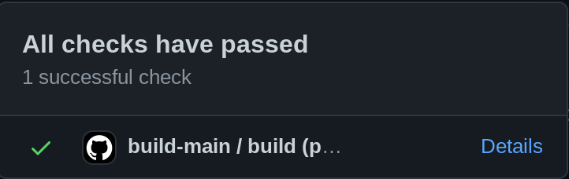
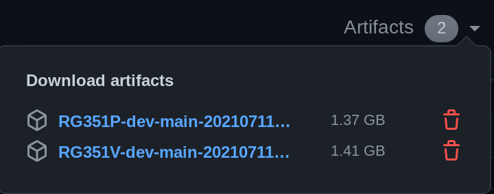

* [Reporting Bugs](#reporting-bugs)
* [Beta Builds](#beta-builds)
* [Development / PR Builds](#development--pr-builds)
* [Building 351ELEC from Source](#building-351elec-from-source)
* [Contributing Code](#contributing-code)
* [Setting up the environment](#setting-up-the-environment)
* [Building Your Contribution](#building-your-contribution)
* [Contributing Community Built Packages](#contributing-community-built-packages)
* [Docker usage](#docker-usage)

## Reporting Bugs
* Check you are using latest released version, only released versions are supported.  
* If you are using a beta build, do not open an issue in [351ELEC](https://github.com/351ELEC/351ELEC).  Instead, report the findings in the `#beta-feedback` channel in [discord](https://discord.gg/bmXtCt88Tz) (Under "Community Contribution").  After submitting and discussing your issue in Discord, an issue can be filed under the *351ELEC-beta* [issues](https://github.com/351ELEC/351ELEC-beta/issues) section.

  * Before reporting an issue with the beta build, try reproducing the issue on the current release.  Please mention the results up front when you bring your issue to Discord.  For example: `When I try xyz in beta build ABC, something bad happens.  However, when I try xyz in in the latest release, I do not see this problem.  Is this a known issue?`.  Try and keep comments concise and constructive.

* Check the existing issues to see if your bug has already reported.  If it has been reported, do not open another bug report.  If it is not reported, use a template and fill it out completely.  Issues opened without using the templates will be closed.
* Be patient, as we are volunteers and working on the project in our spare time.

## Beta Builds
**IMPORTANT NOTE**: Beta builds are for advanced users to test fixes or explore new functionality. 

Builds are released each night when there are new commits to `main`.  Builds are scheduled at 8:00pm UTC, releasing around 8:30 PM UTC.  Users should **expect issues** and have a **backup** of their configs just in case a reflash is needed, etc.  Do **not** file issues on beta builds, use [discord](https://discord.gg/bmXtCt88Tz) (#beta-feedback).  See "[Reporting Bugs](#reporting-bugs)" above.

#### Finding/Installing Beta Builds
The latest beta build can be found on the **351ELEC-beta** [releases](https://github.com/351ELEC/351ELEC-beta/releases/) page.  Builds are installed as normal (using either a `.tar` or a `.img.gz`).

### Using Beta Builds
Beta builds should operate normally.  From the device, you can update to the latest beta build by specifying the `BETA` channel in `Updates & Downloads`. 

If you would like to switch back to the current release, the `RELEASE` channel will switch back to a released version. NOTE: While the `20210603` release is still current, if you switch back to this release you will no longer have automatic updates!

## Development / PR Builds
Dev and PR builds are intended primarily for developers to get the latest changes from `main` or a `PR` before the build hits 'beta'.  Use at your own risk.

**Finding/Installing Development Builds**
- To find the latest development build, click on the 'green checkbox'() on the 351ELEC [main](https://github.com/351ELEC/351ELEC) page. Then click *Details*.

  Ex: .
  
 - On the following page, find the "Artifacts" link on the upper right.  Click and select the zip file for the RG351P or RG351V.
   
   Ex: .
   - NOTE: Currently `.zip` files are provided due to technical limitations with Github Actions. Both the `.tar` and `.img.gz` are inside the zip file.  In the future, separate zips for .tar and `.img.gz` may be provided.
- Unzip the zip file and then use `.tar` or `.img.gz` inside as normal to update.

**Using development builds**
- The `version` of a dev build will be encoded in the .tar/img.gz file and shown on the EmulationStation menu as normal.  This can help identify if you are on the latest development build
- **Online updates**: All released builds are considered 'newer' than dev builds.  This means if you do an online update from a dev build, you will go back to the latest release build.  *NOTE*: There is currently **no** 'development' channel to stay up to date with the latest dev builds.  One may be implemented in the future.

##### PR Builds
Pull Request ([PR](../../pulls)) builds are very similar to development builds and can be used to test PR's with the following caveats:
* Feedback specific to the PR can be left as comments on the PR itself.  Please keep any feedback short and constructive or it may be deleted.  If you have the same comment as another user, use a 'reaction' on that comment to help keep the comments clean and easy to navigate for the developer and others.
* Build zip only includes the `.tar` file to keep build speed faster.
* Builds are found on the 'Checks' tab of the PR.  Then click on 'Artifacts' link in the upper right.

## Building 351ELEC from Source
Building 351ELEC from source is a fairly simple process. It is recommended to have a minimum of 4 cores, 16GB of RAM, and an SSD with 200GB of free space. The build environment used to develop 351ELEC is Ubuntu 20.04, your mileage may vary when building on other distributions.  Building using Docker is also supported.
```
sudo apt update && sudo apt upgrade

sudo apt install gcc make git unzip wget xz-utils libsdl2-dev libsdl2-mixer-dev libfreeimage-dev libfreetype6-dev libcurl4-openssl-dev rapidjson-dev libasound2-dev libgl1-mesa-dev build-essential libboost-all-dev cmake fonts-droid-fallback libvlc-dev libvlccore-dev vlc-bin texinfo premake4 golang libssl-dev curl patchelf xmlstarlet patchutils gawk gperf xfonts-utils default-jre python xsltproc libjson-perl lzop libncurses5-dev device-tree-compiler u-boot-tools rsync p7zip unrar libparse-yapp-perl zip binutils-aarch64-linux-gnu dos2unix p7zip-full

git clone https://github.com/351ELEC/351ELEC.git 351ELEC  

cd 351ELEC

make clean

make world
```
The make world process will build a 32bit and 64bit userland and generate a 64bit image which will be located in 351ELEC/release. Follow the installation steps to write your image to a microSD for testing.

## Contributing Code
First, thank you.  As a volunteer project, maintaining a project like this can be difficult.  Any contributions are greatly appreciated.  If you are contributing there are a few guidelines that need to be followed for your contribution to be accepted.

* We recommend that you work in a feature branch in your own fork, and that you submit pull requests of tested changes to the main branch for integration.
* Code contributions are to be licensed as GPLv2 or later and marked when possible.
* All package contributions must be marked with the appropriate license for the package in package.mk.  If the package license is not included in the licenses directory, please include it with your pull request.

## Setting up the environment
There is an available virtual machine created by Christian Haitian that's good do ports for 351ELEC, more info [here](https://forum.odroid.com/viewtopic.php?p=306185#p306185).

Moreover, in order to locally build 351ELEC from sources it's possible to use a docker, more info [here](https://github.com/351ELEC/351ELEC/wiki/Contributing-to-351ELEC/#docker-usage).

## Building Your Contribution
When you are ready to test your package you can use the 'build' script located in the scripts folder.  If your world environment is not up-to-date, the script will build all of the package dependencies before building the package.

### Example:
```
351ELEC$ ./scripts/build packages/games/libretro/dosbox-pure
```

To install the package into the image root, use the 'install' command.

### Example:
```
351ELEC$ ./scripts/install packages/games/libretro/dosbox-pure
```
> Before submitting a contribution it should build and install properly in your test environment.
## Contributing Community Built Packages
351ELEC will have support for a community package repository starting with v1.0.7.  Contributing a package is simple, but there are a few requirements.  Please note that all packages should be submitted as pull requests to the repository.

### Community Catalog Schema
The community catalog is stored in this repository at /metadata/packages.cfg.  It is a plain pipe delimited text file which uses the following schema.
```
{PACKAGE NAME}|{PACKAGE URL}|{SHA256SUM}
```
> Packages must not contain spaces in the package name.
#### Example Submission
```
my_application|https://github.com/myaccount/myrepo/releases/download/1/my_application.zip|d06489dcf04c602ddacc6f80b2809e6d25fd6298c461966e666e19d3188e04be
```

### Package Schema
The community repository accepts only .zip files and they are required to conform to the following schema.

| Script | Function | Location |
|----|----|----|
| install.sh | Installing your port or software | Package Root |
| uninstall.sh | Uninstalling your port or software | Package Root |
| hashes | sha256sums of binaries | Package Root |
| system-packagename.png | Image (ports only) | Anywhere |
| system-packagename-thumb.png | Thumbnail (ports only) | Anywhere |
| application data | The application and its data | Anywhere, including external |

The package must unzip to a subdirectory equal to the package's name in the repository.  If the package in the repository is 'my_application' then the installation files are expected to be found located at 'my_application/(un)install.sh' after extracting.

#### Example Package
The first package added to the repository may be used as an example to help determine how to develop your package.

| Package | Repository |
|----|----|
| Drastic | https://github.com/fewtarius/packages |

### Installing and Uninstalling
Your package is expected to integrate with the rest of the system and require minimal user intervention, unless additional data/packs are required for operation.

* All licenses must be followed.  Failure to follow a license will result in being disallowed from contributing to this repository.
* You may pull packages from external sources, as long as they are well supported, hashed, and validated.
  * Use well known sources such as GitHub.  Do not use forums, etc.
  * Include sha256 checksums in the package zip and use them to validate binaries and all external data during installation.
* You are expected to clean up 100% of your package remnants except for user data on uninstall.
* Use the proper tools for integration with the system, such as xmlstarlet to add content to a system or gamelist.xml.
* Use tests to ensure that your install and uninstall do not create errors.
* If it is not your data, do not touch it.  Failure to follow this rule will result in being disallowed from contributing to this repository.
* Package all required libraries.  If you do not know what libraries you need, do not submit until you do.
* Ensure there is a start script for your application, and that it uses LD_LIBARY_PATH to reference your libraries first.
> All packages will be reviewed prior to accepting and merging the request.
### Integration
You may use xmlstarlet to add and remove your application from the appropriate system XML files.  Here's an example.

#### Adding your Application
```
CFG="/storage/.emulationstation/es_systems.cfg"
xmlstarlet ed --omit-decl --inplace \
        -s '//systemList' -t elem -n 'system' \
        -s '//systemList/system[last()]' -t elem -n 'name' -v 'myapplication'\
        -s '//systemList/system[last()]' -t elem -n 'fullname' -v 'My Application'\
        -s '//systemList/system[last()]' -t elem -n 'path' -v '/storage/roms/myapplication'\
        -s '//systemList/system[last()]' -t elem -n 'manufacturer' -v 'Me'\
        -s '//systemList/system[last()]' -t elem -n 'release' -v '2020'\
        -s '//systemList/system[last()]' -t elem -n 'hardware' -v 'portable'\
        -s '//systemList/system[last()]' -t elem -n 'extension' -v '.zip .ZIP .pak .PAK'\
        -s '//systemList/system[last()]' -t elem -n 'command' -v "/emuelec/scripts/$START_SCRIPT %ROM%"\
        -s '//systemList/system[last()]' -t elem -n 'platform' -v 'myplatform'\
        -s '//systemList/system[last()]' -t elem -n 'theme' -v 'myapplication'\
        $CFG
```

#### Removing your Application
```
CFG="/storage/.emulationstation/es_systems.cfg"
xmlstarlet ed -L -P -d "/systemList/system[name='myapplication']" $CFG
```

## Docker usage

Building with Docker simplifies the build process as any dependencies are contained within the Docker image.  In order to make docker builds easy to use and keep automation in the project unified, I've updated the Makefile to help building via docker.  This would mean more or less any system with make installed (technically `gmake`) and Docker along with a few system utilities (`id`, `pwd`) would be able to build 351ELEC.

All make commands are available via docker, by prepending `docker-`. For example, `make RG351V` becomes `make docker-RG351V` and `make clean` becomes `make docker-clean`.  This enables existing and new commands added to the Makefile to be easily used via docker without affecting existing behavior.  Credit to the batocera team for the idea of how this could work: (https://github.com/batocera-linux/batocera.linux/pull/1434/files) and @dhwz  for pointing out their Docker integration.

### New docker make commands:                                                                            
- `make docker-image-build` - Builds the docker image based on the Dockerfile.  This is not required unless changes are needed locally.
- `make docker-image-pull` - Pulls docker image from dockerhub.  This will update to the latest image and replace any locally built changes to the docker file.

Example building with docker:
```
git clone https://github.com/351ELEC/351ELEC.git 351ELEC  

cd 351ELEC
make docker-image-pull  # not required - but will ensure the latest image is pulled in
make docker-clean
make docker-world
```

### Notes on Docker installation
- It is recommended to use the Docker installation process from Docker itself as opposed to distribution specific process (for example, don't use: `apt install docker.io`).  You should use: https://docs.docker.com/engine/install/.  This is mainly to avoid really old versions of docker (ubuntu 16.04/18.04) and WSL2 doesn't work properly with `docker.io` even in Ubuntu 20.04
- On WSL2 the command `sudo service docker start` is needed before the build command, for example `make docker-RG351P`.

### Thoughts on caching the toolchain (future)
By standardizing the build environment into Docker, it would be possible to cache/share build artifacts (such as the toolchain) in the future to improve build times, but this is not currently done.  I'm not sure the exact right way to do this, so excluding this change for now as (I think) it would require some updates to the Makefile to do right.

One idea  would be if we built the toolchain in the docker build and then stored the toolchain in another standard directory (/opt/toolchain/aarch64, etc), the Makefile could be updated to populate the build* directories from the /opt/toolchain if the toolchain didn't exist, etc.  I'm also not sure if only the `toolchain` directory is needed to be saved or the other dependent packages too (FYI: I saw some errors with `libltdl` which I think is part of `libtool` that indicate just the `toolchain` directory may not be enough.)

