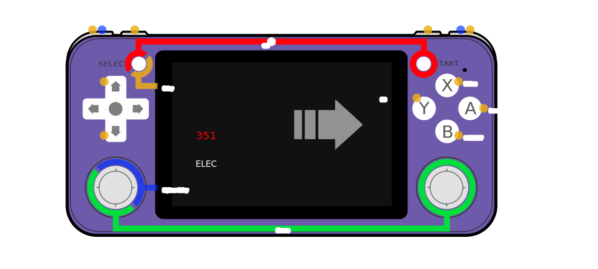

# Getting to Know 351ELEC

* [Controls and Hot Keys](#controls-and-hot-keys)
* [Adding Games](#adding-games)
* [Accessing the handheld over a network](#accessing-the-handheld-over-a-network)
* [Installing Drastic](#installing-drastic)
* [Default Performance Settings](#default-performance-settings)
* [ScummVM, Ports, and MS-DOS](#scummvm-ports-and-ms-dos)
* [How to Update](#how-to-update-351elec) - Learn how to update to the newest version of 351ELEC
* [Adding Background Music to EmulationStation](#adding-background-music-to-emulationstation)
* [Netplay](#netplay)
* [Backups and Indentity](#backups-and-identity) - Learn how to backup your settings
* [Using the Movie Player](#using-the-movie-player)

## Controls and Hot Keys

EmulationStation Controls are active when you're in 351ELEC's rom selection menu, and RetroArch Hotkeys are active while you're playing (most) games.

### RetroArch Hotkeys
Every hotkey is commanded by combining the SELECT button with the desired function key as shown in the image below. For example, to do a savestate the hotkey is SELECT + R1. Brightness is an exception; it uses L3. The hotkeys for the 351V are the same as the ones for the P and M, with the exception that R3 on the P/M is the F (function) button on the V instead.

| Hotkey | RG351P/M | RG351V |
|----|----|----|
| RA Menu | SELECT + X, L3 + R3 | SELECT + X, L3 + F |
| Quit | SELECT + START (x2) | SELECT + START (x2) |
| Pause | SELECT + A | SELECT + A |
| Screenshot | SELECT + B | SELECT + B |
| FPS | SELECT + Y | SELECT + Y |
| Save State | SELECT + R1 | SELECT + R1 |
| Load State | SELECT + L1 | SELECT + L1 |
| Fast Forward | SELECT + R2 | SELECT + R2 |
| Rewind** | SELECT + L2 | SELECT + L2 |
| Save State Slot + | SELECT + Up | SELECT + Up |
| Save State Slot - | SELECT + Down | SELECT + Down |
| Brightness + | L3 + R1 | L3 + R1 |
| Brightness - | L3 + L1 | L3 + L1 |
| Kill Process | L2 + Select + Start | L2 + Select + Start |

(As a note, L3 and R3 are the buttons for pressing in the left or right analog stick)

** Rewind is currently disabled by default because enabling it can cause significant slowdown in games. It needs to be enabled before the hotkey will work.

### Retrorun Hotkeys

Retrorun is a separate emulator from RetroArch, with its own cores. It's included because there are some games it can play that RetroArch fails at. Retrorun is very barebones. There is no menu, there are no configuration files, and there is no controller configuration. What you see is what you get.

Following is a list of all the Retrorun hotkeys:

| Command | Key |
|----|----|
| Quit | SELECT + START |
| Kill Process | L2 + Select + Start |

### EmulationStation Controls

| Key | Function |
|----|----|
| A | Confirm |
| B | Cancel |
| START | Main Menu |
| SELECT | Quick Access, View Options |
| X | Game Options |
| Y | Filter Games |

### Killing the Game Process

Game crashes are rare, but if you find that you cannot leave an emulator using the menu system, you can press **L2 + Select + Start** to kill the game process and return to EmulationStation.

## Adding Games

Games may be added by copying them over the network (rsync, sftp), or by moving the microSD card to your PC. It is important to follow the existing directory structure or your games may not be discovered by 351ELEC.  Be sure to always properly eject the microSD or power off the handheld before removing it.

## Accessing the handheld over a network

When connected to a network, the handheld listens for connections on port 22 (SSH).  If your local network supports DHCP naming the host should appear on your network as '351ELEC'.

| Username | Password |
|----|----|
| root | 351elec |

It is recommended that you change the root password or disable ssh while not in use using the Network Settings menu.  To change the root password type 'passwd' while connected to the handheld over ssh.

## Installing Drastic

This is only necessary on version 20210603 (Crazy Hedgehog) and below. If you are using the beta you already have Drastic installed, and doing this will fail and may mess up your installation!

Due to licensing concerns, the Drastic emulator must be installed separately. To do so, you will need to connect to WIFI or Ethernet.  Once connected follow the steps below.
* From the main interface, press Start.
* Scroll to Updates & Downloads, and press A.
* Scroll to Packages, and press A. 
* Scroll to the Drastic package, and press A.

Drastic will be downloaded and installed.  Restart EmulationStation when complete.

## Default Performance Settings

N64, PSP, and Dreamcast emulators default to the maximum performance option. This is the best mode for most games, but if you are experiencing issues you can change the setting back to on demand performance (auto) for the system or on a game-by-game basis.  All other emulators and ports default to on demand performance.

* Scroll to the emulator or port and press A to list your available games. If you are changing the setting for a game, scroll to the game.
* Press Select
* For system, select Advanced System Options, and press A
* For game, select Advanced Game Options, and press A
* Scroll to Enable Maximum Performance, and set to your preference
* Press B repeatedly to back out to the main menu

## ScummVM, Ports, and MS-DOS

ScummVM, Ports, and MS-DOS are hidden by default in the collections menu. To enable press Start at the main menu screen. Scroll to Game Collection Settings, and press A. Select Systems Displayed, and press A. Scroll to the system you wish to enable and press A. Press B repeatedly to back out to the main menu and EmulationStation will restart automatically.

## How to Update 351ELEC

*NOTE*: OTA updates are returning in the next stable release.

To perform an update, download the .tar file from the latest version of 351ELEC.  Place the .tar in your games partition in the "update" folder, creating it if necessary.  Insert your SD card back into your device and turn it on.  When the update completes your device will reboot.

Alternately, you can scp the .tar file to ~/.update and reboot the handheld to perform an offline update as well.

## Adding Background Music to EmulationStation

EmulationStation will playback any `.flac`, `.ogg` or `.mp3` files (and maybe others?) from the `/storage/roms/bgm` directory.  Simply add them, enable background music from EmulationStation's Main Menu > Sound Settings, and ensure the System Volume is not muted.

351ELEC Discord user [Aaron Mealey](https://aaronmealey.bandcamp.com/) composed [a nice background droning piece for his RG351 device and uploaded it to his Bandcamp page](https://aaronmealey.bandcamp.com/track/sitting-waiting) to share with others.  Thanks, Aaron!

EmulationStation adds one second long fades to the beginning and end of each track; they are fast and simple, and can sound really bad.  Take that into account when processing your own tracks with an audio editor (for example, you can avoid hearing them by padding your audio with one second of silence on either end as desired).

When compressing audio, `.ogg` creates significantly smaller and better sounding files at even lower bitrates than `.mp3`.  For example, VBR 128kbps or 160kbps is normally as low as you want to go with `.mp3`, while `.ogg` at 80kbps and 96kbps very listenable.  At 96kbps, you can get over two hours of music in under 100MB in `.ogg`.  This is a great way to save space while getting more music on your device.

## Netplay

351ELEC enables you to use retroarch's Netplay, for more information please visit the [RetroArch Netplay Section](https://www.retroarch.com/?page=netplay).

Please note that the players must have the same version of 351ELEC or in any case the same rom and the same core.
Unfortunately you cannot use it to trade Pokémon, more info [here](https://docs.libretro.com/guides/netplay-faq/).

Link to the [online lobby](http://lobby.libretro.com/).

## Backups and Identity

Found in: ES Menu > System Settings > Danger Zone! > Backup Identity

What does it do?
It backs up your current EmulationStation settings for menu selections, network details and core configurations.

Specifically the following files: 
- /storage/.config/distribution/configs/distribution.conf
- core and game specific configs from /storage/.config/distribution/configs/emuoptions.conf
- EmulationStation config from - /storage/.config/emulationstation/es_settings.cfg
- root password from /storage/.cache/shadow
- user ssh keys from /storage/.ssh
- host ssh keys from /storage/.cache/ssh
- network configuration from /storage/.cache/connman

What should it be used for?
If you are doing a reflash and want to retain your EmulationStation settings exactly as they are now you can use the file created from this to restore

Steps:
1) Before you start re-flash Open ES Menu > System Settings > Danger Zone! > Backup Identity
2) Press Yes
3) A file called identity.tar.gz will be created in /storage/roms/backup
4) Open the card on your computer and backup the Games partition
5) Reformat your SD card and reflash
6) Boot the device to create a new games partition
7) Turn off the device and connect the SD card to your computer
8) Copy your backed up Games Partition to the SD card
9) Insert your card and start the device
10) During reboot it will restore identity.tar.gz and your ES set up will be restored

## Using the Movie Player
351ELEC includes a movie player that can play a variety of file formats, and use the handheld controls to skip forward, skip backwards, pause, and exit.

### Movie Path
If the path is not created by default, it is ok to create it as below.  The directory name is case sensitive.
* /storage/roms/mplayer

### Supported Formats
* .mp4 .MP4 .mkv .MKV .avi .AVI .mov .MOV .wmv .WMV .m3u .M3U .mpg .MPG .ytb .YTB .twi .TWI

### Control Keys

| HotKey | Action |
|----|----|
| Play/Pause | A |
| Skip 5s | R1 |
| Skip 60s | Select + R1 |
| Back 5s | L1 |
| Back 60s | Select + L1 |
| Quit | Select + Start |
| Kill Process | L2 + Select + Start |
