# PortMaster

[PortMaster](https://github.com/christianhaitian/PortMaster) is a project by Christian Haitian that's designed to make installing ports on rk3326 devices easy.

## Installation

- [Download PortMaster](https://github.com/christianhaitian/PortMaster/raw/main/PortMaster.zip)
- Unzip PortMaster into your `GAMES/ports` directory
- Launch PortMaster by opening ports, then the PortMaster folder, and then running PortMaster

## Games and Compatibility

Below is a list of the ports and whether they're known to work, along with links to the instructions for individual games. That said, this list is likely to get out of date relatively quickly, so check out the [PortMaster Wiki Page](https://github.com/christianhaitian/arkos/wiki/PortMaster) and the [Port Installation Instructions](https://github.com/christianhaitian/arkos/wiki/ArkOS-Emulators-and-Ports-information#ports) for updates and installation instructions.

| Game | Compatibility | Installation Instructions |
|----|----|----|
|  2048 | Working | [PortMaster Instructions](https://github.com/christianhaitian/arkos/wiki/ArkOS-Emulators-and-Ports-information#2048-available-through-portmaster) |
|  Abuse | Working | [PortMaster Instructions](https://github.com/christianhaitian/arkos/wiki/ArkOS-Emulators-and-Ports-information#abuse-available-through-portmaster) |
|  AM2R | Working | [PortMaster Instructions](https://github.com/christianhaitian/arkos/wiki/ArkOS-Emulators-and-Ports-information#am2r-available-through-portmaster) |
|  Blake Stone | Working | [PortMaster Instructions](https://github.com/christianhaitian/arkos/wiki/ArkOS-Emulators-and-Ports-information#blake-stone-aliens-of-gold-available-through-portmaster) |
|  Blobby Volley 2 | Working | [PortMaster Instructions](https://github.com/christianhaitian/arkos/wiki/ArkOS-Emulators-and-Ports-information#blobby-volley-2-available-through-portmaster) |
|  Blockattack | Working | [PortMaster Instructions](https://github.com/christianhaitian/arkos/wiki/ArkOS-Emulators-and-Ports-information#block-attack-available-through-portmaster) |
|  Blood | Working | [PortMaster Instructions](https://github.com/christianhaitian/arkos/wiki/ArkOS-Emulators-and-Ports-information#blood-available-through-portmaster) |
|  Blues Brothers | Working | [PortMaster Instructions](https://github.com/christianhaitian/arkos/wiki/ArkOS-Emulators-and-Ports-information#blues-brothers-available-through-portmaster) |
|  C-Dogs | Working | [PortMaster Instructions](https://github.com/christianhaitian/arkos/wiki/ArkOS-Emulators-and-Ports-information#c-dogs-available-through-portmaster) |
|  Cannonball | Working | [PortMaster Instructions](https://github.com/christianhaitian/arkos/wiki/ArkOS-Emulators-and-Ports-information#cannonball-outrun-available-through-portmaster) |
|  Cave Story | Working | [PortMaster Instructions](https://github.com/christianhaitian/arkos/wiki/ArkOS-Emulators-and-Ports-information#cave-story-evo-available-through-portmaster) |
|  Cave Story-evo | Working | [PortMaster Instructions](https://github.com/christianhaitian/arkos/wiki/ArkOS-Emulators-and-Ports-information#cave-story-evo-available-through-portmaster) |
|  Commander Genius | Working | [PortMaster Instructions](https://github.com/christianhaitian/arkos/wiki/ArkOS-Emulators-and-Ports-information#commander-genius-commander-keen-available-through-portmaster) |
|  CorsixTH (Theme Hospital) | Working | [PortMaster Instructions](https://github.com/christianhaitian/arkos/wiki/ArkOS-Emulators-and-Ports-information#corsixth-theme-hospital-available-through-portmaster) |
|  Devilutionx (Diablo 1) | Working | [PortMaster Instructions](https://github.com/christianhaitian/arkos/wiki/ArkOS-Emulators-and-Ports-information#devilutionx-diablo-1-available-through-portmaster) |
|  Dinothawr | Working | [PortMaster Instructions](https://github.com/christianhaitian/arkos/wiki/ArkOS-Emulators-and-Ports-information#dinothawr-available-through-portmaster) |
| 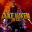 Duke Nukem 3D | Working | [PortMaster Instructions](https://github.com/christianhaitian/arkos/wiki/ArkOS-Emulators-and-Ports-information#duke-nukem-3d-available-through-portmaster) |
| 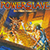 Exhumed | Working | [PortMaster Instructions](https://github.com/christianhaitian/arkos/wiki/ArkOS-Emulators-and-Ports-information#exhumed-aka-powerslave-available-through-portmaster) |
|  Fade to Black GL | Coming Soon |
|  Free Heroes of Might and Magic II | Working | [PortMaster Instructions](https://github.com/christianhaitian/arkos/wiki/ArkOS-Emulators-and-Ports-information#free-heroes-of-might-and-magic-ii-available-through-portmaster) |
|  Freedom Planet | Working | [PortMaster Instructions](https://github.com/christianhaitian/arkos/wiki/ArkOS-Emulators-and-Ports-information#freedom-planet-available-through-portmaster) |
| 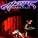 Heart of Darkness | Working | [PortMaster Instructions](https://github.com/christianhaitian/arkos/wiki/ArkOS-Emulators-and-Ports-information#heart-of-darkness-available-through-portmaster) |
| 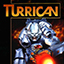 Hurrican (Turrican) | Working | [PortMaster Instructions](https://github.com/christianhaitian/arkos/wiki/ArkOS-Emulators-and-Ports-information#hurrican-turrican-available-through-portmaster) |
| 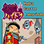 Hydra Castle Labyrinth | Working | [PortMaster Instructions](https://github.com/christianhaitian/arkos/wiki/ArkOS-Emulators-and-Ports-information#hydra-castle-labyrinth-available-through-portmaster) |
|  Iconoclasts | Working | [PortMaster Instructions](https://github.com/christianhaitian/arkos/wiki/ArkOS-Emulators-and-Ports-information#iconoclasts-available-through-portmaster) [RGC Youtube Tutorial](https://www.youtube.com/watch?v=navwk8rGNTw) |
| 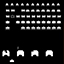 Invaders (Space Invaders Arcade) | Working | [PortMaster Instructions](https://github.com/christianhaitian/arkos/wiki/ArkOS-Emulators-and-Ports-information#invaders-available-through-portmaster) |
|  Maldita Castilla | Working | [PortMaster Instructions](https://github.com/christianhaitian/arkos/wiki/ArkOS-Emulators-and-Ports-information#maldita-castilla-available-through-portmaster) |
|  Moonlight | Not Working | [PortMaster Instructions](https://github.com/christianhaitian/arkos/wiki/ArkOS-Emulators-and-Ports-information#moonlight-nvidia-gamestreaming-app-available-through-portmaster) |
|  Mr. Boom | Working | [PortMaster Instructions](https://github.com/christianhaitian/arkos/wiki/ArkOS-Emulators-and-Ports-information#mr-boom-available-through-portmaster) |
|  NAM | Requires Tweaks | [PortMaster Instructions](https://github.com/christianhaitian/arkos/wiki/ArkOS-Emulators-and-Ports-information#nam-available-through-portmaster) |
| 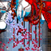 nKaruga | Working | [PortMaster Instructions](https://github.com/christianhaitian/arkos/wiki/ArkOS-Emulators-and-Ports-information#nkaruga) |
| 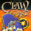 OpenClaw (Captain Claw) | Working | [PortMaster Instructions](https://github.com/christianhaitian/arkos/wiki/ArkOS-Emulators-and-Ports-information#openclaw-available-through-portmaster) |
|  OpenJazz (Jazz Jackrabbit) | Working | [PortMaster Instructions](https://github.com/christianhaitian/arkos/wiki/ArkOS-Emulators-and-Ports-information#openjazz-jazz-jackrabbitavailable-through-portmaster) |
|  OpenOMF - One Must Fall 2097 Remake Project | Working | [PortMaster Instructions](https://github.com/christianhaitian/arkos/wiki/ArkOS-Emulators-and-Ports-information#openomf-available-through-portmaster) |
|  OpenTyrian | Working | [PortMaster Instructions](https://github.com/christianhaitian/arkos/wiki/ArkOS-Emulators-and-Ports-information#opentyrian-available-through-portmaster) |
|  Prehistorik 2 | Working | [PortMaster Instructions](https://github.com/christianhaitian/arkos/wiki/ArkOS-Emulators-and-Ports-information#prehistorik-2-available-through-portmaster) |
| 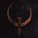 Quake | Working | [PortMaster Instructions](https://github.com/christianhaitian/arkos/wiki/ArkOS-Emulators-and-Ports-information#quake-1-available-through-portmaster) |
| 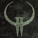 Quake 2 | Working | [PortMaster Instructions](https://github.com/christianhaitian/arkos/wiki/ArkOS-Emulators-and-Ports-information#quake-2-available-through-portmaster) |
|  RAWGL (Another World) | Working | [PortMaster Instructions](https://github.com/christianhaitian/arkos/wiki/ArkOS-Emulators-and-Ports-information#rawgl-available-through-portmaster) |
|  Redneck Rampage | Working | [PortMaster Instructions](https://github.com/christianhaitian/arkos/wiki/ArkOS-Emulators-and-Ports-information#redneck-rampage-1-available-through-portmaster) |
|  Redneck Rampage Rides Again | Working | [PortMaster Instructions](https://github.com/christianhaitian/arkos/wiki/ArkOS-Emulators-and-Ports-information#redneck-rampage-2-available-through-portmaster) |
|  Return to Castle Wolfenstein | Working | [PortMaster Instructions](https://github.com/christianhaitian/arkos/wiki/ArkOS-Emulators-and-Ports-information#return-to-castle-wolfenstein-available-through-portmaster) |
|  Rick Dangerous | Working | [PortMaster Instructions](https://github.com/christianhaitian/arkos/wiki/ArkOS-Emulators-and-Ports-information#rick-dangerous-available-through-portmaster) |
| 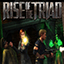 Rise of the Triad | Working | [PortMaster Instructions](https://github.com/christianhaitian/arkos/wiki/ArkOS-Emulators-and-Ports-information#rise-of-the-triad-available-through-portmaster) |
|  Rocks 'N' Diamonds | Working | [PortMaster Instructions](https://github.com/christianhaitian/arkos/wiki/ArkOS-Emulators-and-Ports-information#rocks-n-diamonds-available-through-portmaster) |
|  RVGL (Re-Volt) | Working | [PortMaster Instructions](https://github.com/christianhaitian/arkos/wiki/ArkOS-Emulators-and-Ports-information#rvgl-available-through-portmaster) |
|  SDLPoP (Prince of Persia) | Working | [PortMaster Instructions](https://github.com/christianhaitian/arkos/wiki/ArkOS-Emulators-and-Ports-information#sdlpop-prince-of-persia-available-through-portmaster) |
|  Shadow Warrior | Working | [PortMaster Instructions](https://github.com/christianhaitian/arkos/wiki/ArkOS-Emulators-and-Ports-information#shadow-warrior-available-through-portmaster) |
|  Shovel Knight | Working | [PortMaster Instructions](https://github.com/christianhaitian/arkos/wiki/ArkOS-Emulators-and-Ports-information#shovel-knight---treasure-trove-available-through-portmaster) |
|  Sonic 1 | Working | [Install Instructions](#sonic-1--2) |
|  Sonic 2 | Working | [Install Instructions](#sonic-1--2) |
|  Sonic CD | Working | [PortMaster Instructions](https://github.com/christianhaitian/arkos/wiki/ArkOS-Emulators-and-Ports-information#sonic-cd-available-through-portmaster) |
|  Sonic Robo Blast 2 | Working | [PortMaster Instructions](https://github.com/christianhaitian/arkos/wiki/ArkOS-Emulators-and-Ports-information#coming-soon-srb2-sonic-robo-blast-2-available-through-portmaster) |
|  SorR (Streets of Rage Remake)| Working | [PortMaster Instructions](https://github.com/christianhaitian/arkos/wiki/ArkOS-Emulators-and-Ports-information#sorr-streets-of-rage-remakeavailable-through-portmaster) |
|  Space Cadett Pinball | Working | [PortMaster Instructions](https://github.com/christianhaitian/arkos/wiki/ArkOS-Emulators-and-Ports-information#space-cadet-pinball-available-through-portmaster) |
|  Spelunky | Working | [PortMaster Instructions](https://github.com/christianhaitian/arkos/wiki/ArkOS-Emulators-and-Ports-information#spelunky-available-through-portmaster) |
|  Super Mario War | Working | [PortMaster Instructions](https://github.com/christianhaitian/arkos/wiki/ArkOS-Emulators-and-Ports-information#super-mario-war-available-through-portmaster) |
|  SuperTux | Working | [PortMaster Instructions](https://github.com/christianhaitian/arkos/wiki/ArkOS-Emulators-and-Ports-information#supertux-available-through-portmaster) |
|  Tomb Raider 1 | Working | [PortMaster Instructions](https://github.com/christianhaitian/arkos/wiki/ArkOS-Emulators-and-Ports-information#tomb-raider-1-available-through-portmaster) |
|  Undertale | Working | [PortMaster Instructions](https://github.com/christianhaitian/arkos/wiki/ArkOS-Emulators-and-Ports-information#undertale-available-through-portmaster) |
|  Ur-Quan Masters | Working | [PortMaster Instructions](https://github.com/christianhaitian/arkos/wiki/ArkOS-Emulators-and-Ports-information#ur-quan-masters-available-through-portmaster) |
| 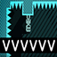 VVVVVV | Working | [PortMaster Instructions](https://github.com/christianhaitian/arkos/wiki/ArkOS-Emulators-and-Ports-information#vvvvvv-available-through-portmaster) |
|  World War II GI | Working  | [PortMaster Instructions](https://github.com/christianhaitian/arkos/wiki/ArkOS-Emulators-and-Ports-information#world-war-ii-gi-available-through-portmaster) |

### Requiring Tweaks:

* Nam - remove sudo, libatomic.so.1 & libogg.so.0 missing 
