# Transferring files to/from your RG Device

- [Direct transfer (SD Card onto your Computer)](#direct-transfer-sd-card-onto-your-computer)
  - [Windows PC](#windows-pc)
  - [Mac OS X](#mac-os-x)
  - [Linux](#linux)
- [Network transfer (Via WIFI or OTG Network adapters)](#network-transfer-via-wifi-or-otg-network-adapters)
  - [Windows PC – Samba (Easiest)](#windows-pc--samba-easiest)
  - [Windows PC – SFTP (Harder)](#windows-pc--sftp-harder)
    - [Installing FileZilla](#installing-filezilla)
    - [Using FileZilla](#using-filezilla)
  - [MacOS X – Samba (Easiest)](#macos-x--samba-easiest)
  - [MacOS X – Filezilla (harder)](#macos-x--filezilla-harder)
  - [Android – AndFTP (harder)](#android--andftp-harder)

## Direct transfer (SD Card onto your Computer)

This is by far the easiest method. First off, make sure your RG Device is turned off fully (Check the LED indicator, if it’s off, your device is off). 

{:refdef: .clearfix }
{: .notebox.float-md-end }
> # Does your RG device have two SD card slots?
>
> If you want to access your game files, get your 2nd SD Card (the rightmost one!), OS Files usually go on the 1st SD card (The one on the left!)

Remove the SD card with the files you want to access and insert it onto a Memory Card reader on your computer of choice.
{: refdef }

### Windows PC

{:refdef: .clearfix}
{: .float-end }
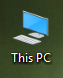

Once you insert the SD card, you should hear a little jingle and it should appear under My Computer (or "This PC"). Usually labeled "`AMBRELC`" for your OS files, and "`STORAGE`" for your roms, bioses files, etc.
{: refdef }

{:refdef: .clearfix}
{: .float-end }
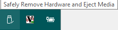

Move your files around, once you’re done, **make sure you remove your card safely from your computer (should be an icon on your system tray)**, and reinsert it onto your RG device.
{: refdef }

### Mac OS X

{:refdef: .clearfix}
{: .float-end }
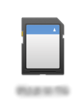 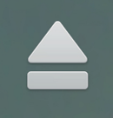

When you insert your SD Card, it should show as an icon on your desktop. The process after this is simple, move files around, and when you are done, **make sure to "eject" your SD card by dragging it to your waste bin (When dragging, your waste bin should develop an eject button)**.
{: refdef }

Because of OSX and its inner-workings, you have one more step to do once your device boots. In the main menu of your RG device, navigate to the tools section and select "`Run Remove ._ files`"

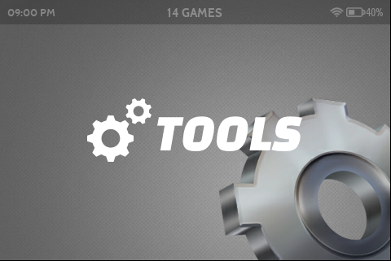
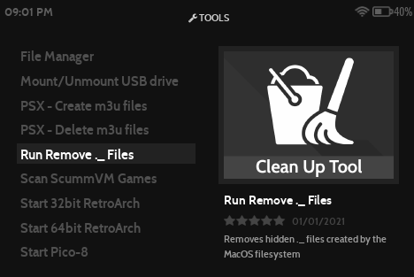

This will remove some residual files OSX creates and avoids issues running your games and homebrew

### Linux

{:refdef: .clearfix}
{: .float-md-end }
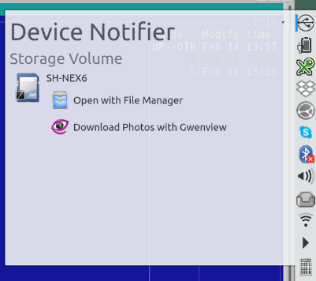

With Linux things are a bit more complicated. Depending on your install or distro, inserting your SD card might be detected by your Window Manager, and should be fairly user friendly, or not shown completely and you’ll have to [mount it yourself](https://www.techwalla.com/articles/how-to-mount-an-sd-card-in-linux).  Just remember to **unmount / eject it once you’re done moving files**, and in a terminal (for good measure) run "sync" and only eject your SD Card once it is done. This is to ensure any pending file operations are done.
{: refdef }

## Network transfer (Via WIFI or OTG Network adapters)

{:refdef: .clearfix}
{: .float-end }
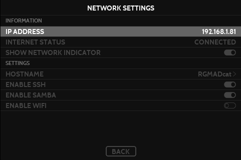

Before we begin on this journey, we need to make sure that:

1. Your computer and RG device are connected to the same network
2. You know your RG device’s IP address
	1. In order to figure this out, in the console selection screen, press START
	2. Navigate to "Network Settings"
	3. First item should be your IP Address (Example : `192.168.1.81`)
{: refdef }

### Windows PC – Samba (Easiest)

{:refdef: .clearfix}
{: .float-end }
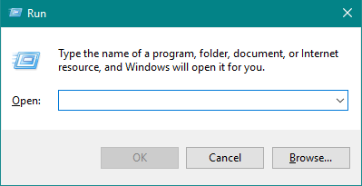

On a Windows PC, this process is simple, first make sure that in the "Network Settings" Screen ( see above) Samba is enabled. Once enabled, go back to your PC and Press the `Windows Key` on your keyboard and the "`R`" key. A window called "Run" should appear.

Now, remember that IP Address we got above? This is where we will need it!

In the "Run" window, type in:
* `\\192.168.1.81\roms` -- For your ROMS folders
* `\\192.168.1.81\update` -- To put your update files
* `\\192.168.1.81\logs` -- For your log files
* `\\192.168.1.81\config` -- For your config files for emulators, games, etc…
**(Replace the example IP with yours, don’t forget!!)**
Press OK and you should see a window with all your files! Remember these are transferred in real time!
{: refdef }

### Windows PC – SFTP (Harder)

This process will require a 3rd party application. If you already have FileZilla installed, feel free to skip the instalation instructions!

#### Installing FileZilla

{:refdef: .clearfix}
{: .float-end }
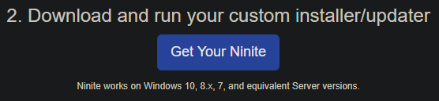

Head on over to [Ninite](https://ninite.com/) and choose . Then scroll down and click the "Get your Ninite" button. It will download an application that will then download and install the latest version of Filezilla for you.
{: refdef }

#### Using FileZilla

{:refdef: .clearfix}
{: .float-end }
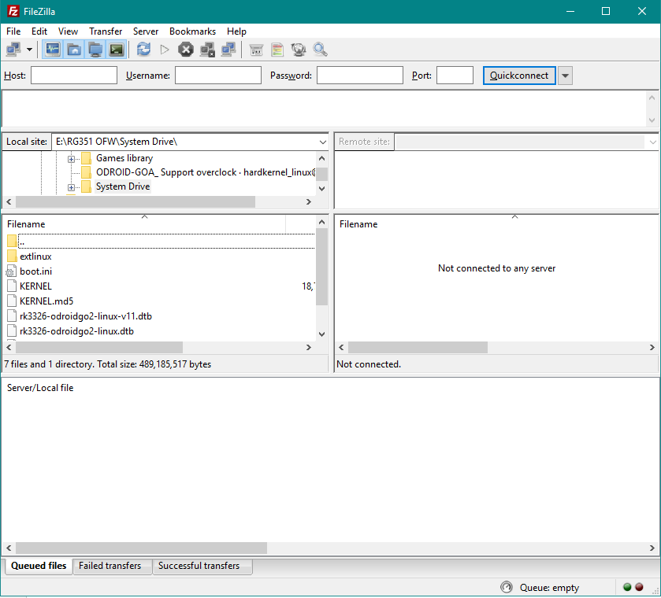

Open filezilla, and you should be greeted with this screen. While it may be a bit intimidating, don’t worry, it’ll become second nature soon enough.
First, let’s set the settnigs so we can connect to our RG device! On top of the window you will see a field called "`Host`", "`Username`", "`Password`" and "`Port`". Their values are as follows:

* Host : `sftp://<YOUR IP ADDRESS>`
	* Example : `sftp://192.168.1.81`
	* Username : root
	* Password : `351elec` OR `amberelec`
		* This will depend on when you flashed your firmware. If you’re here from the 351Elec days, try that password first
	* Port : (optional) 22
{: refdef }

Now press the "`Quickconnect`" button on the far right, and if everything went well you should see this:

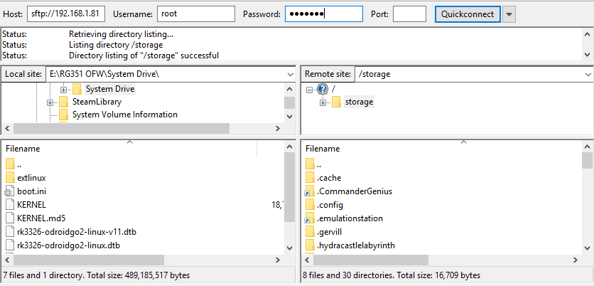

Note : The files on the left side are your computer’s files. The files on the right are that of the RG.

With that in mind, also keep in mind the location you’re at. Normally you start at `/storage` (Look at "Remote Site") and don’t need to go outside that folder, but if you do, here are some paths to important folders you might need:

* `/tmp/logs` – This is where you find logs of whatever application you just ran. These are useful for trouble shooting and finding issues with your games.
* `/storage/roms` – Where your rom files are at (And your ports, and homebrew, etc..)

{: .protip }
> # Protip
>
> You can drag files from outside FileZilla *into* FileZilla. Just make sure to drop them on the right side if you want to upload files to your RG device!

* `/storage/.config` – Where your config files will be
* `/storage/roms/update` – Where you can put your update files

Transfers will look like this on the bottom part of Filezilla:

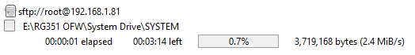

Much like the Samba method above, these transfers are in real time! Wait for them to finish! Don’t restart or turn off your device until they’re done.

### MacOS X – Samba (Easiest)

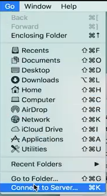

From your finder menu, select "Go" -> "Connect to Server…". You should see this screen:

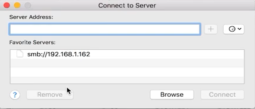

Now, as per the example in the picture, simply type `smb://<YOUR IP ADDRESS>` and press enter (Example : `smb://192.168.1.81`) You should then be greeted with this window for credentials:

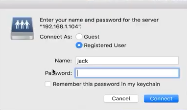

For your RG, you needn’t use credentials, just press the  radiobutton, press  and OSX should ask you which share to access:

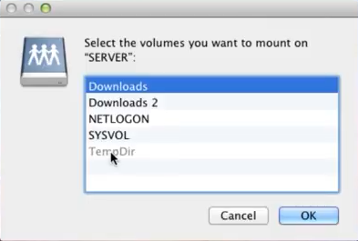

And press OK. And a new window should appear:

{: .protip }
> # Protip
>
> Make sure to see above about SD card files and OSX, you need to run the "Run Remove ._ files" Tool after you’re done. And make sure to eject your RG device once you’re done! Your OS might misbehave if waiting/timing out with the RG.

Use it to move files around like you would on your PC.

### MacOS X – Filezilla (harder)

Installation process is [simple and covered everywhere](https://www.youtube.com/watch?v=n80yyrnvKcA) and you can see above on [how to use Filezilla](#using-filezilla).

### Android – AndFTP (harder)

#### Installing and setting up AndFTP

First thing’s first, you need to install [andFTP](https://play.google.com/store/apps/details?id=lysesoft.andftp) and then:

| 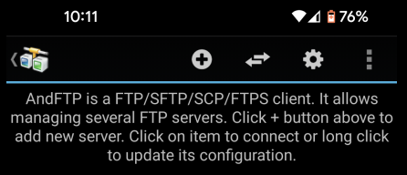 Step 1 : Press the (+) button on top | 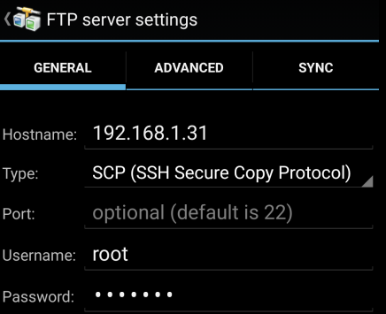 Step 2 : Fill in the credentials as seen above (password can be either 351elec or amberelec ) |  Step 3 : Press the save button, give it a name if requested. |
| 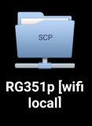 Step 4 : Find your profile you set up and click on it | 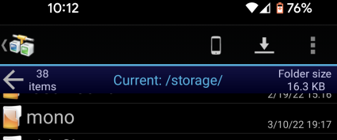 Step 5 : move your files! |

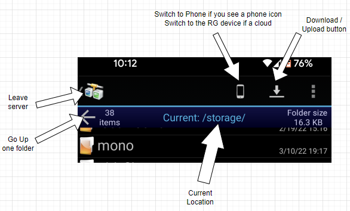

Here’s a simple diagram on how to use AndFTP.