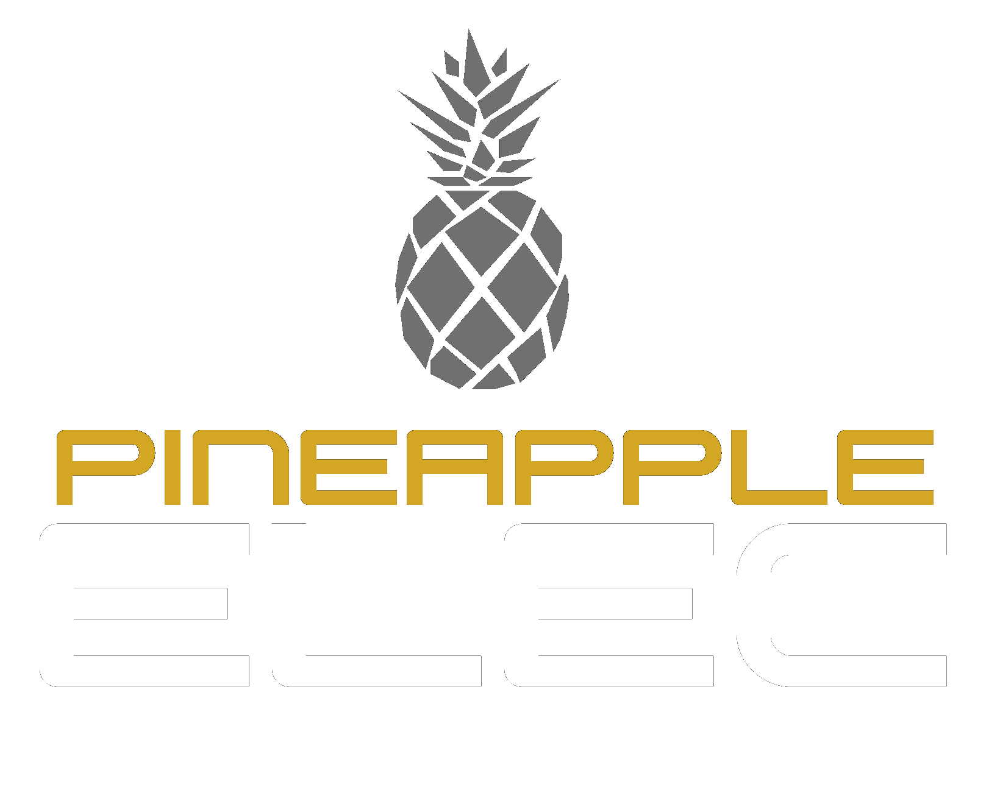

# Fill your life with Pineapple

Our Italian devs love Hawaiian Pizza so much, we've decided to become PineappleELEC! We've also added support for installing on the [AnanasBoy](images/ananasboy.jpeg), the open source gaming hardware powered by a pineapple battery! You can download it from the [Download Page](Download). Make sure you download the correct version for your device.

If you want to know all the new cool features, take a look at the [Release Notes](https://github.com/351ELEC/351ELEC/releases/tag/20211122)!

## About PineappleELEC

PineappleELEC is an open source firmware developed for the Anbernic RG351P/M/V/MP, RG552, and the AnnasBoy open source hardware.

_Join Our Community:_ [https://discord.com/invite/R9Er7hkRMe](https://discord.com/invite/R9Er7hkRMe)

### Features
* A 64bit Firmware optimized for the RG351P/M/V/MP and RG552.
* Fully Open Source with a wonderful community of users, contributors and helpers.
* An up-to-date and fresh [user interface](themes).
* Pre-configured optimized defaults allowing you to pick up and play.
* Integrated scraper for getting images, videos, manuals and maps.
* Native support for [RetroAchievements](https://retroachievements.org/) on supported emulators.
* Package manager to install and update games and themes made by our community.
* An exFAT games partition easily accessible from Linux, Windows and MacOS.

### Installation

Please visit the [Installation](Installation#overview) page for installation instructions.

### Getting Help

If you have general questions or need help, join us on Discord: [https://discord.com/invite/R9Er7hkRMe](https://discord.com/invite/R9Er7hkRMe)

For bug reports and feature requests, use one of the templates on the issues tab.  The more information you provide, the easier it will be to assist.  Please note that issues opened without using a form will be closed.  Please do not use the issue tracker for technical support, or your issue will be closed.
