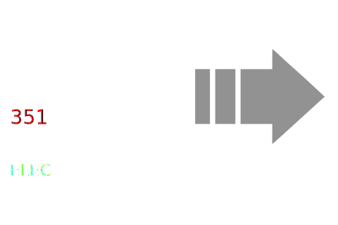

## Welcome to 351ELEC!

351ELEC is an open source firmware developed for the Anbernic RG351P/M/V.

_Join Our Community:_ [https://discord.gg/R9Er7hkRMe](https://discord.gg/R9Er7hkRMe)

### Features
* A 64bit Firmware optimized for the RG351P/M/V.
* Fully Open Source with a wonderful community of users, contributors and helpers.
* An up-to-date and fresh [user interface](https://github.com/anthonycaccese/es-theme-art-book-3-2).
* Pre-configured optimized defaults allowing you to pick up and play.
* Integrated scraper for getting images, videos, manuals and maps.
* Native support for [RetroAchievements](https://retroachievements.org/) on supported emulators.
* Package manager to install and update games and themes made by our community.
* An EXFAT games partition easily accessible from Linux, Windows and MacOS.

### [Installation](Installation#overview)

Please visit the [Installation](Installation#overview) page for installation instructions.

### Getting Help

If you have general questions or need help, join us on Discord: [https://discord.gg/R9Er7hkRMe](https://discord.gg/R9Er7hkRMe)

For bug reports and feature requests, use one of the templates on the issues tab.  The more information you provide, the easier it will be to assist.  Please note that issues opened without using a form will be closed.  Please do not use the issue tracker for technical support, or your issue will be closed.
